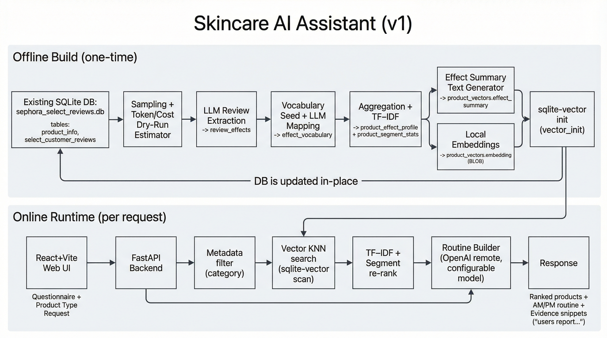
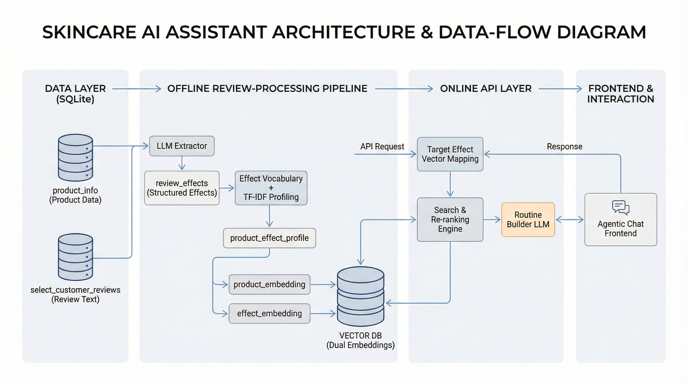
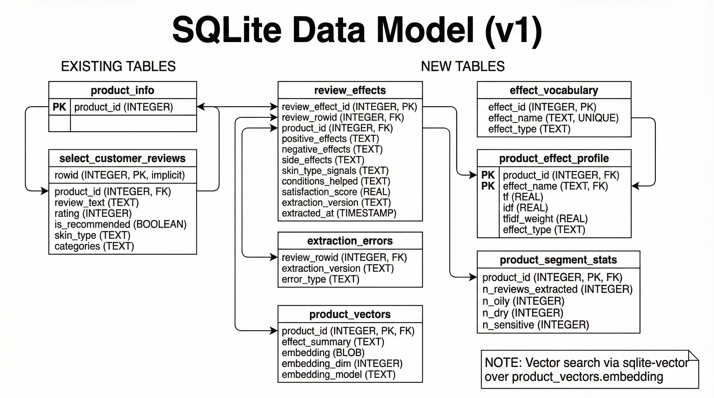

# Skincare Recommendation AI Assistant (Sephora Reviews)

Evidence-grounded skincare recommendations and AM/PM routines derived from **real user reviews** (not marketing claims).

## Highlights

- **Review-grounded recommendations:** every recommendation is phrased as *“users report…”* and backed by snippets.
- **Personalization:** uses a lightweight user profile (skin type, sensitivities, goals, conditions).
- **Hybrid retrieval:** vector similarity search + transparent TF–IDF effect matching + segment re-ranking.
- **Local-first architecture:** SQLite as the source of truth (with `sqlite-vector` for embeddings search).

## Dataset (current DB)

Post-cleanup SQLite DB (`sephora_select_reviews.db`) contains:

- **238,929** skincare reviews (`select_customer_reviews`)
- **2,522** products (`product_info`) — **2,518** Skincare + 4 Gifts

Notes from profiling:
- Review coverage is concentrated: **584** products have **≥10** reviews.
- Among reviewed products, review counts range roughly **150–995** per product.

Supporting profiling/cleanup reports:
- `docs/database_findings.md`
- `docs/database_cleanup_report.md`

## What the system does (v1)

1. **Onboarding Q&A** collects a session-only user profile (skin type, conditions/goals, sensitivities).
2. User asks for a product type (e.g., *“sunscreen for oily skin with redness”*).
3. System returns a **ranked list** of products with concise *“users report…”* summaries.
4. User requests a routine → system generates **AM/PM routine steps** using shortlisted candidates.
5. User asks *“why this product?”* → system returns **evidence snippets** from reviews.

> Safety note: recommendations summarize review patterns and are **not medical advice**.

## Architecture






## Data model



The v1 schema extends the base DB with derived tables for review effects, TF–IDF profiles, and per-product embeddings.
See: `docs/db_schema.md`.

## API surface (contract)

The backend is designed around a small FastAPI surface (session-only profile):

- `GET /health`
- `POST /profile`, `PATCH /profile`
- `POST /recommend`
- `POST /routine`
- `GET /explain/product/{product_id}`
- `POST /explain/evidence`

Full request/response examples: `docs/api_contracts.md`.

## Example outputs

### Product recommendations (simplified)

```json
{
  "product_type": "sunscreen",
  "results": [
    {
      "product_id": "...",
      "product_name": "...",
      "brand_name": "...",
      "price_usd": 42.0,
      "score": 0.812,
      "users_report_summary": "Users report hydration and reduced redness; some report pilling.",
      "top_benefits": [{"effect": "hydration", "weight": 0.12}],
      "top_negatives": [{"effect": "pills_under_makeup", "weight": 0.05}]
    }
  ]
}
```

### AM/PM routine (simplified)

```json
{
  "morning": [
    {"step": 1, "slot": "cleanser", "product_id": "...", "notes": "..."},
    {"step": 2, "slot": "treatment", "product_id": "...", "notes": "..."},
    {"step": 3, "slot": "moisturizer", "product_id": "...", "notes": "..."},
    {"step": 4, "slot": "sunscreen", "product_id": "...", "notes": "..."}
  ],
  "evening": [
    {"step": 1, "slot": "cleanser", "product_id": "...", "notes": "..."},
    {"step": 2, "slot": "treatment", "product_id": "...", "notes": "..."},
    {"step": 3, "slot": "moisturizer", "product_id": "...", "notes": "..."}
  ],
  "disclaimer": "These suggestions summarize what users report in reviews and are not medical advice."
}
```

## Tech stack (planned v1 implementation)

- **Backend:** Python 3.14, FastAPI, Pydantic v2, SQLite
- **Vector search:** `sqlite-vector` via `sqliteai-vector`
- **Frontend:** React + Vite + TypeScript
- **LLM usage:**
  - Offline extraction of structured review effects (model decided via dry-run cost gating)
  - Routine generation using a configurable remote OpenAI model

Details: `docs/tech_stack.md`.

## Skills demonstrated

- LLM-assisted information extraction (structured JSON)
- Data modeling + SQL (SQLite schema design, indexing)
- Vector search + hybrid ranking (embeddings + TF–IDF re-ranking)
- API contract design (FastAPI)
- Product-oriented thinking (user flows, explainability/evidence)

## Repo tour

- `skincare_ai_design_plan.md` — end-to-end system design (pipeline + retrieval + agent flows)
- `docs/technical_requirements.md` — v1 scope, user stories, and acceptance criteria
- `docs/api_contracts.md` — API contracts (what the app exposes)
- `docs/db_schema.md` — DB schema for derived tables
- `docs/diagrams/` — architecture + data model diagrams

## Implementation details (deep dive)

For a more engineering-focused breakdown (pipeline steps, schemas, ranking strategy, and planned module layout), see:

- **`docs/README_IMPLEMENTATION.md`**

## Project status

This repository currently contains the **dataset cleanup/profiling outputs**, **system design**, **DB schema**, **API contracts**, and **architecture diagrams**. The application code is intended to be implemented following these contracts/specs.
